# Pipeline ESG-washing — Giải thích toàn bộ kết quả

> Tài liệu này giải thích từng bước pipeline, ý nghĩa của mỗi chỉ số, công thức, và đọc kết quả từng figure. Không cần đọc code mới hiểu được.

---

## Mục lục

1. [Bức tranh tổng quan](#1-bức-tranh-tổng-quan)
2. [Bước 1 — Tách báo cáo thành chunks](#2-bước-1--tách-báo-cáo-thành-chunks)
3. [Bước 2 — Phân loại trụ ESG](#3-bước-2--phân-loại-trụ-esg)
4. [Bước 3 — Phân loại cam kết](#4-bước-3--phân-loại-cam-kết)
5. [Bước 4 — Chấm độ cụ thể (rubric)](#5-bước-4--chấm-độ-cụ-thể-rubric)
6. [Chỉ số CTI / NAR / QDR — kết quả RQ1](#6-chỉ-số-cti--nar--qdr--kết-quả-rq1)
7. [Công bố chọn lọc — kết quả RQ2](#7-công-bố-chọn-lọc--kết-quả-rq2)
8. [Xu hướng theo thời gian — kết quả RQ3](#8-xu-hướng-theo-thời-gian--kết-quả-rq3)
9. [BRI — tính giá trị hội tụ — kết quả RQ4](#9-bri--tính-giá-trị-hội-tụ--kết-quả-rq4)
10. [Say-do gap + SHAP — kết quả RQ5](#10-say-do-gap--shap--kết-quả-rq5)
11. [Baseline từ vựng và cross-lingual transfer](#11-baseline-từ-vựng-và-cross-lingual-transfer)
12. [Tổng hợp tất cả kết quả](#12-tổng-hợp-tất-cả-kết-quả)

---

## 1. Bức tranh tổng quan

**Câu hỏi nghiên cứu:** Ngân hàng Việt Nam có đang *nói suông* về ESG không — tức là cam kết nhiều nhưng thiếu nội dung cụ thể?

**Tại sao không dùng rating bên thứ ba?** Vì Việt Nam gần như không có dữ liệu xếp hạng ESG độc lập. Thay vào đó, ta đo *chính ngôn ngữ trong báo cáo* xem nó cụ thể đến đâu.

**Pipeline tổng quát:**

```
Báo cáo PDF
    ↓ OCR + làm sạch
Văn bản thuần
    ↓ Semantic chunking (≤256 token)
Chunks (~13.800 đơn vị)
    ↓ PhoBERT Topic Classifier
Gán nhãn E / S / G (đa nhãn)
    ↓ PhoBERT Commitment Classifier
Lọc: chunk nào là "cam kết ESG"?
    ↓ Qwen3 Specificity Rubric
Chấm mức 0 / 1 / 2 từng cam kết
    ↓ Tổng hợp per (bank, year)
CTI  NAR  QDR
    ↓ Phân tích thêm
BRI (embedding) · Say-do gap · SHAP
```

**Corpus:** 9 ngân hàng × 5 năm (2020–2024) = **45 quan sát panel**

| Ngân hàng | Viết tắt |
|-----------|----------|
| Agribank, BIDV, MB Bank, OCB, SHB | Ngân hàng thương mại lớn + tầm trung |
| Techcombank, Vietcombank, VietinBank, VPBank | Ngân hàng cổ phần lớn |

---

## 2. Bước 1 — Tách báo cáo thành chunks

**Vấn đề:** Báo cáo thường niên dài hàng trăm trang. Phân tích cả file một lúc không thực tế. Cần tách thành *đơn vị nhỏ có nghĩa*.

**Giải pháp:** Dùng *semantic-text-splitter* — gộp các câu liên tiếp cho đến khi đạt ≤ 256 token, **theo ranh giới câu** (không cắt ngang câu).

**Tại sao 256 token?** Vì đây là độ dài context tối đa của mô hình chấm rubric (Qwen3). Cắt đúng ranh giới câu để không mất thực thể hay số liệu nằm ở cuối câu.

### Phân bố độ dài chunks

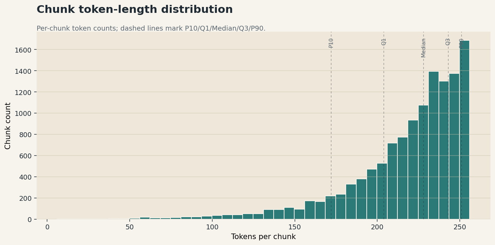

*Đọc figure:* Mỗi ô là một ngân hàng. Biểu đồ violin cho thấy phân bố số token trong một chunk. Hầu hết chunks có độ dài trung vị ~228 token, tập trung sát trần 256 — nghĩa là splitter hoạt động tốt, lấp đầy context mà không tràn. Các điểm ngoại lai (outlier) gần 0 là các đoạn văn rất ngắn (tiêu đề, bullet đơn lẻ).

**Số liệu chính:**
- Tổng: **13.812 chunks** trên toàn bộ corpus
- Trung vị: 228 token | p90: 252 token | Max: 256 token
- Không có chunk rỗng

---

## 3. Bước 2 — Phân loại trụ ESG

**Mục tiêu:** Mỗi chunk được hỏi: *"Chunk này nói về Môi trường (E), Xã hội (S), Quản trị (G), hay không thuộc trụ nào?"*

**Mô hình:** PhoBERT (mô hình ngôn ngữ tiền huấn luyện chuyên tiếng Việt, 20GB văn bản). Có 3 đầu ra sigmoid độc lập → một chunk có thể thuộc *nhiều trụ* cùng lúc (đa nhãn).

**Translate-train:** Nhãn huấn luyện tiếng Anh (từ dataset ESGBERT) được dịch sang tiếng Việt, rồi tinh chỉnh PhoBERT trực tiếp trên tiếng Việt. Lý do: nếu dùng mô hình tiếng Anh trực tiếp sẽ sụp đổ hiệu năng (xem Phần 11).

**Kết quả phân loại theo trụ:**

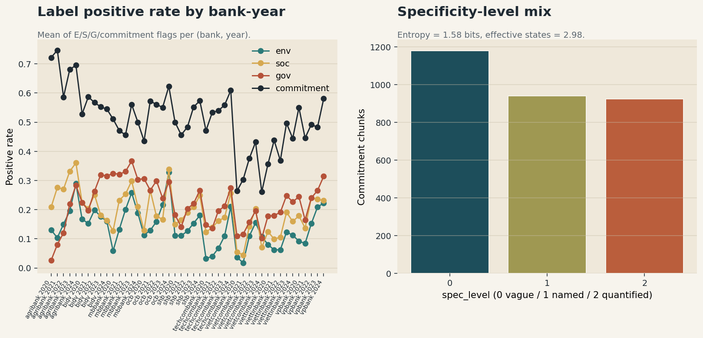

*Đọc figure:* Mỗi cột là một ngân hàng. Tỉ lệ positive rate (% chunks được gán nhãn E / S / G). Nhận xét chính:
- **G (Quản trị) luôn có positive rate cao nhất** → Quản trị chiếm phần lớn nội dung báo cáo
- **E (Môi trường) thấp nhất** ở hầu hết ngân hàng → phản ánh thực tế ngân hàng viết ít về môi trường
- Tỉ lệ chênh lệch này là *tín hiệu đầu tiên* của hành vi né trụ khó (sẽ đo chính xác ở RQ2)

---

## 4. Bước 3 — Phân loại cam kết

**Vấn đề:** Không phải mọi câu về ESG đều là *cam kết*. Ví dụ:
- ❌ *"Ngân hàng đã hoạt động từ năm 1988"* → thông tin mô tả, không phải cam kết
- ✅ *"Ngân hàng cam kết giảm phát thải 30% vào 2030"* → cam kết ESG

**Giải pháp:** Bộ phân loại nhị phân CommitmentHF (nền PhoBERT), phân biệt câu cam kết vs không cam kết.

**Cổng topic:** Một chunk chỉ vào phân tích nếu **vừa** là cam kết **vừa** có ít nhất 1 trụ E/S/G dương. Điều này loại bỏ các cam kết tài chính thuần túy (*"cam kết tăng trưởng tín dụng 15%"*) khỏi mẫu số.

**Ký hiệu:** Sau lọc, mỗi ô (bank, year) có **N** = số cam kết ESG hợp lệ. N dao động 6–159 tùy ngân hàng và năm.

---

## 5. Bước 4 — Chấm độ cụ thể (rubric)

Đây là bước **trung tâm** của pipeline. Mỗi cam kết ESG được Qwen3-1.7B chấm theo thang 3 mức:

| Mức | Tên | Định nghĩa | Ví dụ thực tế |
|-----|-----|-----------|---------------|
| **0** | Mơ hồ (cheap-talk) | Khẩu hiệu / tính từ đẹp, không kiểm chứng được | *"Hướng tới tương lai xanh và bền vững"* |
| **1** | Hành động có tên | Có hành động/chương trình CÓ TÊN, gắn với ngân hàng, nhưng chưa có số | *"Triển khai hệ thống quản lý carbon nội bộ"* |
| **2** | Định lượng | Có con số đo được, gắn với chính ngân hàng | *"Dư nợ tín dụng xanh đạt 74.177 tỷ đồng năm 2023"* |

**Quy tắc attribution-aware (nhận biết chủ thể):**
Chỉ tính Mức 2 khi con số **quy về chính ngân hàng**. Các số sau **không** tính:
- Số của NHNN: *"theo quy định NHNN tỉ lệ dự trữ bắt buộc là 3%"*
- Số toàn ngành: *"tổng dư nợ tín dụng xanh toàn ngành đạt 500.000 tỷ"*
- Tiêu chuẩn quốc tế: *"theo tiêu chuẩn ISO 14001"*

**Chống hallucination:** Bước `verify_rubric` kiểm tra mọi con số trong output của Qwen3 có thực sự xuất hiện trong văn bản gốc không → loại bỏ trường hợp mô hình "bịa số".

---

## 6. Chỉ số CTI / NAR / QDR — kết quả RQ1

### Công thức

Với mỗi ô (ngân hàng `b`, năm `y`), gọi `N` = số cam kết ESG hợp lệ:

$$\text{CTI}(b,y) = \frac{\text{số cam kết Mức 0}}{N} \quad \text{(Cheap Talk Index — tỉ lệ nói suông)}$$

$$\text{NAR}(b,y) = \frac{\text{số cam kết Mức 1}}{N} \quad \text{(Named Action Rate — tỉ lệ hành động có tên)}$$

$$\text{QDR}(b,y) = \frac{\text{số cam kết Mức 2}}{N} \quad \text{(Quantified Disclosure Rate — tỉ lệ định lượng)}$$

**Luôn luôn:** CTI + NAR + QDR = 1

**Đọc ý nghĩa:**
- **CTI cao** → ngân hàng nói nhiều khẩu hiệu → **rủi ro washing cao**
- **QDR cao** → ngân hàng có nhiều cam kết với con số cụ thể → **thực chất cao**
- **NAR cao** → ngân hàng mô tả hành động cụ thể nhưng chưa định lượng → **vùng xám**

### Kết quả toàn panel (45 quan sát)

| Chỉ số | Trung bình | CI 95% |
|--------|-----------|--------|
| CTI | **0,372** | [0,345 ; 0,400] |
| NAR | 0,309 | [0,284 ; 0,334] |
| QDR | 0,319 | [0,293 ; 0,348] |

→ **Hơn 37% cam kết ESG là nói suông.** Chỉ 32% đạt mức định lượng.

### Bản đồ rủi ro (CTI vs QDR) từng ngân hàng

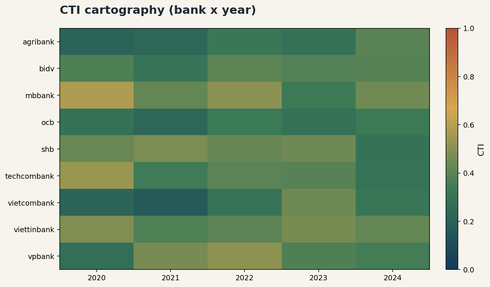

*Đọc figure:*
- **Trục X (→ phải):** CTI cao = nói suông nhiều → xấu
- **Trục Y (↑ trên):** QDR cao = định lượng nhiều → tốt
- **Góc lý tưởng:** dưới-phải (CTI thấp, QDR cao)
- **Góc nguy hiểm:** trên-trái (CTI cao, QDR thấp)
- **Kích thước bong bóng:** tỉ lệ với số cam kết trung bình N̄

Nhận xét:
- **Vietcombank** (QDR cao, CTI thấp) = công bố thực chất nhất nhưng N̄ rất nhỏ (~30 cam kết/báo cáo) → cần diễn giải thận trọng
- **MB Bank** (CTI ~0,46) = rủi ro washing cao nhất
- **Agribank, OCB** = an toàn hơn (CTI thấp, nhưng NAR cao = mô tả hành động chứ chưa có số)

### Dải phân vị CTI theo năm (quantile ribbons)

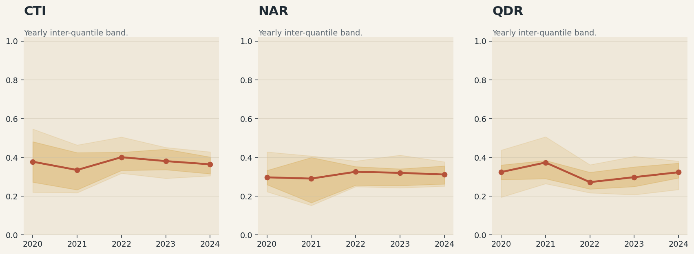

*Đọc figure:* Mỗi dải là một khoảng phân vị của CTI (hoặc NAR, QDR) qua 9 ngân hàng theo từng năm. Dải rộng = chênh lệch lớn giữa các ngân hàng. Đường giữa = trung vị. Nhận xét: dải CTI luôn rộng (~0,20–0,58) và không thu hẹp theo năm → sự phân hóa giữa ngân hàng tốt và xấu không giảm.

---

## 7. Công bố chọn lọc — kết quả RQ2

**Câu hỏi:** Ngân hàng có né trụ khó (Môi trường) và tập trung vào trụ dễ (Quản trị, Xã hội) không?

### Công thức tỉ trọng trụ

$$\text{share}(p) = \frac{n_p}{n_E + n_S + n_G}, \quad p \in \{E, S, G\}$$

`n_p` = số chunk ESG thuộc trụ p trong ô (bank, year). Share đo **tỉ trọng ngôn ngữ** dành cho mỗi trụ.

### Kết quả trung bình toàn panel

| Trụ | Share trung bình |
|-----|----------------|
| Môi trường (E) | **0,241** ← thấp nhất |
| Xã hội (S) | 0,349 |
| Quản trị (G) | **0,410** ← cao nhất |

**Kiểm định Friedman:** χ² = 50,1, **p = 1,3 × 10⁻¹¹** → bác bỏ mạnh giả thuyết ba trụ ngang nhau.

**Wilcoxon ghép cặp:**
- E vs G: p = 3,3 × 10⁻⁹ (E thấp hơn G rõ rệt)
- E vs S: p = 1,4 × 10⁻⁹
- S vs G: p = 0,0014

### Heatmap công bố chọn lọc

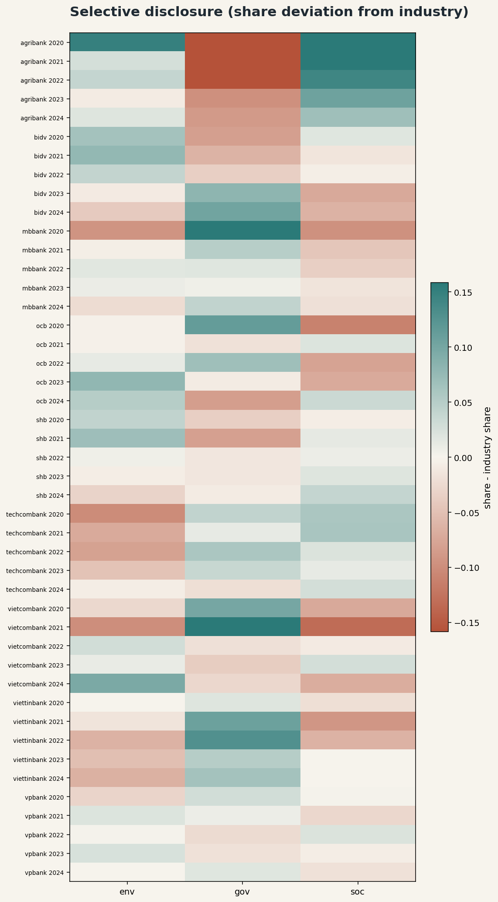

*Đọc figure:* Mỗi hàng là một ngân hàng, mỗi cột là một trụ (E/S/G), màu đậm = share cao. **Toàn bộ 9 ngân hàng đều có cột E nhạt nhất** → không phải ngẫu nhiên mà là hành vi hệ thống.

Trường hợp đặc biệt:
- **Agribank:** share(S)=0,50 rất cao → chú trọng Xã hội (cộng đồng, nông nghiệp)
- **VietinBank, MB Bank:** share(G) ≈ 0,47–0,48 → thiên nặng Quản trị
- **Techcombank:** share(E) = 0,179 → thấp nhất trong 9 ngân hàng

**Tại sao ngân hàng né Môi trường?** Vì cam kết môi trường đòi số liệu khó: phát thải CO₂, tiêu thụ năng lượng, tỉ lệ tín dụng xanh theo chuẩn quốc tế. Cam kết quản trị thì dễ hơn: *"tuân thủ Basel II/III"*, *"họp HĐQT đầy đủ"*.

---

## 8. Xu hướng theo thời gian — kết quả RQ3

**Câu hỏi:** Theo năm, các ngân hàng có *cải thiện chất lượng* cam kết ESG hay chỉ *nói nhiều hơn*?

### Số liệu theo năm

| Năm | CTI | NAR | QDR | N̄ cam kết |
|-----|-----|-----|-----|-----------|
| 2020 | 0,378 | 0,297 | 0,325 | 43,1 |
| 2021 | 0,335 | 0,291 | 0,374 | 49,2 |
| 2022 | 0,401 | 0,326 | 0,273 | 65,2 |
| 2023 | 0,381 | 0,321 | 0,298 | 80,0 |
| 2024 | 0,364 | 0,312 | 0,324 | 101,2 |

**Spearman correlation:**
- N̄ ~ năm: ρ = **+0,609** (p < 0,001) → số lượng tăng mạnh
- CTI ~ năm: ρ = **+0,031** (p = 0,84) → không có xu hướng
- QDR ~ năm: ρ = **−0,073** (p = 0,63) → không cải thiện

→ **Ngân hàng nói nhiều hơn nhưng không cụ thể hơn.** Từ 43 cam kết/báo cáo (2020) lên 101 (2024), nhưng CTI vẫn ~37%.

**Thêm nữa:** tương quan CTI ~ N̄ = **+0,372** (p = 0,012) → càng có nhiều cam kết thì tỉ lệ nói suông càng tăng (pha loãng nội dung thực chất).

### Quỹ đạo CTI từng ngân hàng 2020–2024

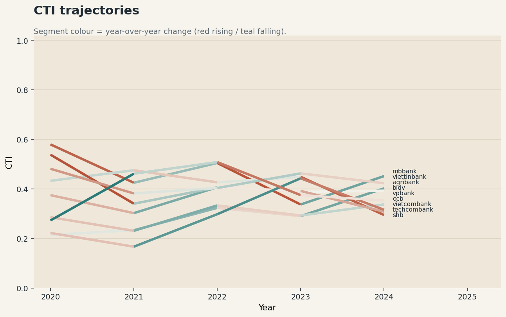

*Đọc figure:* Mỗi đường màu = một ngân hàng. Đường đứt nét = trung bình toàn panel. Dải bóng = CI 95% bootstrap.

Nhận xét:
- Không có ngân hàng nào giảm CTI bền vững qua 5 năm
- MB Bank có CTI cao và biến động lớn
- SHB giảm mạnh năm 2024 (từ 0,45 xuống 0,29) — đây là tín hiệu tốt nhưng cần theo dõi thêm
- Đường trung bình dao động quanh 0,35–0,40 mà không giảm rõ ràng

---

## 9. BRI — tính giá trị hội tụ — kết quả RQ4

### BRI là gì?

**BRI (Boilerplate Reuse Index)** = đo mức độ ngân hàng *copy ngôn ngữ chung* từ ngân hàng khác.

**Cách tính:**
1. Lấy embedding véc-tơ của mỗi cam kết (dùng sentence embedder)
2. **Trung tâm hóa:** trừ đi véc-tơ trung bình toàn corpus. **Tại sao?** Vì embedding câu bị *anisotropy* — cosine thô bão hòa ở ~0,64 cho mọi cặp câu, không phân biệt được nội dung. Sau trung tâm hóa, cosine mới phản ánh đúng độ tương đồng nội dung.
3. Với mỗi cam kết của ngân hàng B trong năm Y: tính cosine lớn nhất tới tất cả cam kết của **ngân hàng khác** trong cùng năm Y
4. BRI(b,y) = trung bình các cosine lớn nhất đó

**Ý nghĩa:** BRI cao = ngân hàng dùng ngôn ngữ rất giống ngân hàng khác = **boilerplate ngành** (copy nhau). BRI thấp = ngôn ngữ độc đáo hơn.

### Kết quả — kiểm định hội tụ

| Kiểm định | Kết quả |
|-----------|---------|
| Spearman(CTI, BRI) | **ρ = −0,353** (p = 0,018, n=45) |
| Spearman(NAR, BRI) | **ρ = +0,300** (p = 0,045, n=45) |

**Đọc ý nghĩa:**
- **CTI cao → BRI thấp:** Ngân hàng nói suông dùng ngôn ngữ *mơ hồ riêng* (khẩu hiệu mỗi người viết khác nhau), **không** phải boilerplate ngành
- **NAR cao → BRI cao:** Ngôn ngữ được chia sẻ nhiều nhất giữa các ngân hàng là *các chương trình, sáng kiến có tên* (như "hệ thống quản lý môi trường", "tín dụng xanh theo chuẩn GRI") — những thứ này có Mức 1 (có tên, chưa có số)

**Tại sao kết quả này quan trọng?** Nó xác nhận rubric CTI **không bị nhiễu** bởi "ngôn ngữ phổ biến". Nếu CTI chỉ đo mức phổ biến của ngôn ngữ thì CTI cao phải đi kèm BRI cao (ngôn ngữ chung = phổ biến). Nhưng kết quả ngược lại → rubric đang đo đúng **độ cụ thể**, không phải **mức phổ biến**.

### PCA không gian đặc trưng washing

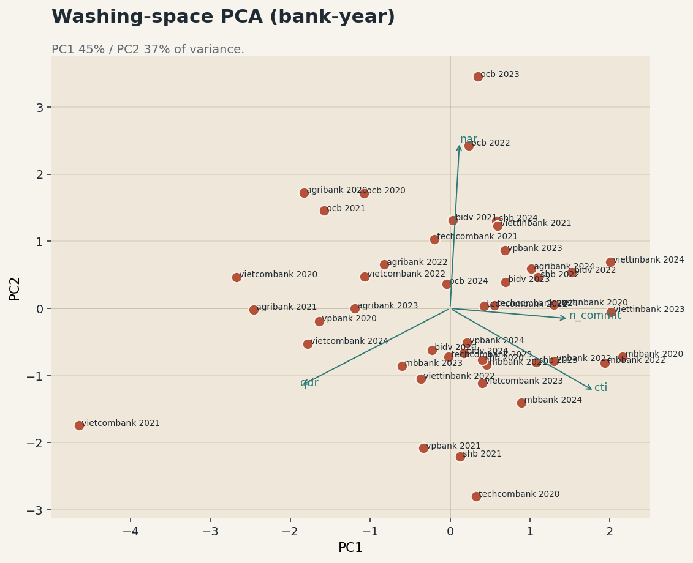

*Đọc figure:* Mỗi điểm là một ô (bank, year). Hai trục là 2 thành phần chính (PC1, PC2) rút ra từ ma trận đặc trưng gồm CTI, NAR, QDR, BRI, N. Các mũi tên (biplot) chỉ hướng của từng đặc trưng. Nhận xét: CTI và QDR kéo về hai phía đối nghịch trên PC1 (xác nhận chúng đo ngược nhau), BRI tách sang PC2 (tín hiệu bổ sung, không trùng với specificity).

---

## 10. Say-do gap + SHAP — kết quả RQ5

### Say-do gap là gì?

**Say-do gap** = khoảng cách giữa "nói suông" và "định lượng" **trong cùng một trụ**.

$$\Delta_p(b,y) = \text{CTI}_p(b,y) - \text{QDR}_p(b,y)$$

- `CTI_p` = tỉ lệ nói suông **chỉ tính riêng trụ p**
- `QDR_p` = tỉ lệ định lượng **chỉ tính riêng trụ p**
- **Δ > 0:** trụ đó nói suông nhiều hơn định lượng
- **Δ ≈ 0:** cân bằng
- **Δ < 0:** định lượng nhiều hơn nói suông

### Kết quả say-do gap theo trụ

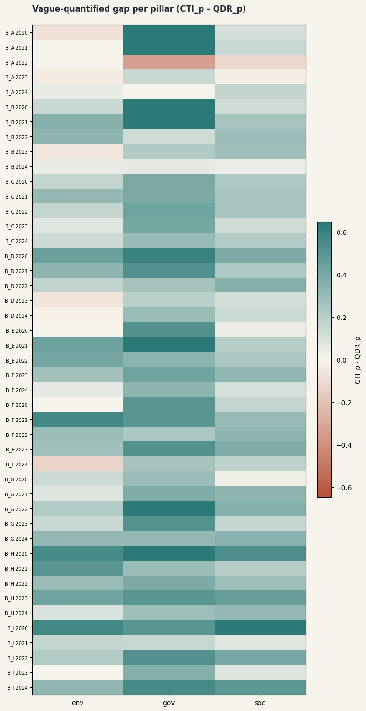

*Đọc figure:* Mỗi cột violin là phân bố của Δ_p qua 45 ô. Đường ngang = trung vị.

| Trụ | Δ trung bình | Ý nghĩa |
|-----|-------------|---------|
| Môi trường (E) | **+0,026** | Gần cân bằng |
| Xã hội (S) | **−0,010** | Gần cân bằng (định lượng nhỉnh hơn chút) |
| Quản trị (G) | **+0,327** | **Nói suông vượt xa định lượng** |

**Giải thích:** Quản trị là trụ *cheap-talk nội trụ* nặng nhất. Tức là khi ngân hàng **có** viết về Quản trị, 1/3 là nói suông mà không định lượng. Ví dụ điển hình: *"Ngân hàng cam kết tuân thủ đầy đủ các quy định quản trị"* — nghe có vẻ cam kết nhưng không có con số nào.

Ngược lại, Môi trường và Xã hội: **khi ngân hàng có cam kết ở hai trụ này**, tỉ lệ định lượng khá tương xứng (vd: tín dụng xanh = có số, đào tạo nhân viên = có số). Nhưng nhớ từ RQ2: ngân hàng **viết ít hơn về Môi trường** — tức là né, không phải cải thiện.

### Ngân hàng định lượng về điều gì?

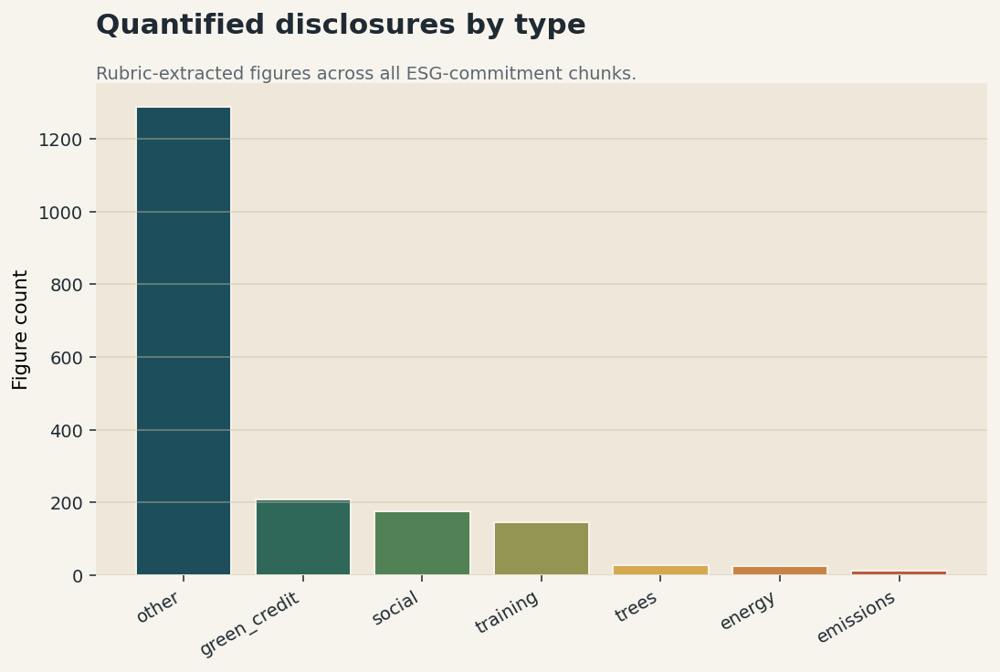

*Đọc figure:* Bar chart số lần xuất hiện của từng loại hành động định lượng (Mức 2) trên toàn 45 ô.

| Loại | Count | Ý nghĩa |
|------|-------|---------|
| Tín dụng xanh | **202** | Ngân hàng rất tích cực báo cáo dư nợ tín dụng xanh |
| Xã hội | 156 | Các con số về hỗ trợ cộng đồng, an sinh |
| Đào tạo | 141 | Số giờ đào tạo, số nhân viên đào tạo |
| Cây xanh | 27 | Số cây trồng |
| Năng lượng | 23 | Tiêu thụ điện, tiết kiệm năng lượng |
| **Phát thải** | **13** | ← **Cực kỳ thấp** |

**Kết luận quan trọng:** Ngân hàng Việt Nam **giỏi định lượng tài chính xanh** (tín dụng xanh, trái phiếu xanh) nhưng **gần như không báo cáo phát thải carbon của chính mình** (13 lần trong 5 năm × 9 ngân hàng). Đây là khoảng trống minh bạch lớn nhất.

### SHAP — điều gì quyết định một cam kết có số hay không?

**Mô hình:** Random Forest phân loại mức cụ thể (0/1/2) từ 12 đặc trưng cấu trúc, **không dùng thông tin ngân hàng/năm** (chống data leakage).

**Đặc trưng 12 chiều:**
- `token_count`, `char_count`, `word_count` — độ dài
- `has_digit`, `n_digit_runs`, `has_year`, `pct_digit_chars` — chữ số
- `p_env`, `p_soc`, `p_gov`, `p_commitment` — xác suất từ các classifier
- `rel_position` — vị trí tương đối trong tài liệu (0=đầu, 1=cuối)

**Kết quả:** macro-F1 = **0,548** (3-class, chance = 0,33). Mô hình học được tín hiệu thực.

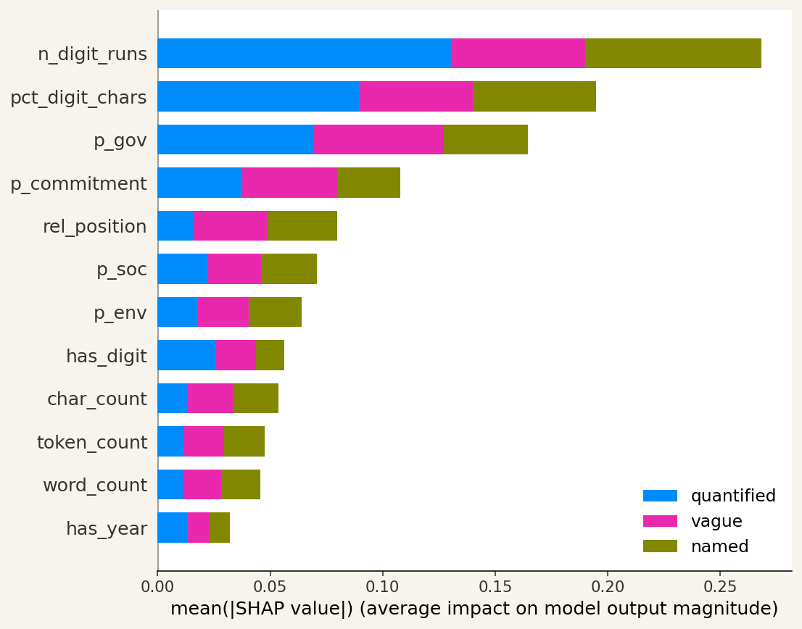

*Đọc figure:* Thanh bar = tầm quan trọng SHAP trung bình. Thanh dài hơn = đặc trưng đó ảnh hưởng nhiều hơn đến dự đoán mức cụ thể.

| Đặc trưng | Tầm quan trọng | Giải thích |
|-----------|----------------|-----------|
| `n_digit_runs` | Cao nhất | Số lần xuất hiện chuỗi chữ số liên tiếp → có số = dấu hiệu Mức 2 |
| `pct_digit_chars` | Thứ 2 | % ký tự là chữ số → cam kết nhiều số = cụ thể hơn |
| `p_gov` | **Thứ 3** | Xác suất thuộc Quản trị → **cam kết Quản trị có xu hướng MƠ HỒ hơn** (phù hợp say-do gap cao ở G) |
| `p_commitment` | Thứ 4 | Xác suất là cam kết → bổ sung cho rubric, không dư thừa |
| `rel_position` | Thứ 5 | Cam kết ở cuối tài liệu (phần hành động/kế hoạch) cụ thể hơn |

---

## 11. Baseline từ vựng và cross-lingual transfer

**Câu hỏi:** Có cần thiết dùng PhoBERT (tiếng Việt) không? Hay dùng mô hình tiếng Anh cũng được?

**Thí nghiệm:** TF-IDF + Logistic Regression (đơn giản nhất, không dùng neural) với 3 cấu hình:

| Cấu hình | Huấn luyện trên | Test trên |
|----------|----------------|----------|
| VI→VI | Tiếng Việt | Tiếng Việt |
| EN→VI | Tiếng Anh | Tiếng Việt |
| EN→EN | Tiếng Anh | Tiếng Anh |

### Kết quả macro-F1

| Cấu hình | Phân loại trụ (E/S/G) | Phân loại cam kết |
|----------|----------------------|------------------|
| VI→VI | **0,832** | **0,664** |
| EN→VI | **0,220** | **0,470** |
| EN→EN | 0,787 | 0,641 |

### Top tokens phân biệt từng trụ (VI→VI)

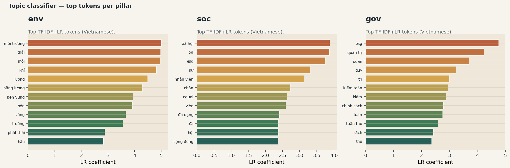

*Đọc figure:* Mỗi panel = một trụ. Thanh bar = hệ số LR (dương = từ này → trụ đó). Ví dụ trụ E: *môi trường, thải, khí, năng lượng, bền vững* → đúng từ vựng ESG tiếng Việt.

### Ý nghĩa

**EN→VI sụp đổ** từ 0,832 xuống còn 0,220 (mất 61 điểm!) → đặc trưng từ vựng tiếng Anh **hoàn toàn không chuyển giao** sang tiếng Việt. Đây là lý do pipeline dùng translate-train với PhoBERT:

```
Nhãn tiếng Anh → dịch sang tiếng Việt → huấn luyện PhoBERT
```

Điều thú vị: EN→VI với cam kết (0,470) ít sụp hơn chủ đề (0,220), vì cam kết có đặc trưng ngữ pháp/cấu trúc ít phụ thuộc ngôn ngữ hơn (động từ như *"cam kết", "sẽ", "hướng tới"* tương đồng nhất định với tiếng Anh).

---

## 12. Tổng hợp tất cả kết quả

### Bảng tóm tắt 5 RQ

| RQ | Câu hỏi | Kết quả chính | Ý nghĩa |
|----|---------|---------------|---------|
| **RQ1** | Nói suông phổ biến đến đâu? | CTI = 37,2% | Hơn 1/3 cam kết ESG là khẩu hiệu |
| **RQ2** | Ngân hàng có né trụ khó? | Friedman p = 1,3×10⁻¹¹; E=24% vs G=41% | **Có** — né Môi trường, dồn vào Quản trị |
| **RQ3** | Chất lượng có cải thiện theo năm? | CTI~năm ρ=0,031 (không đáng kể) | **Không** — nhiều hơn nhưng không tốt hơn |
| **RQ4** | Rubric CTI có đáng tin không? | Spearman(CTI,BRI)=−0,353 p=0,018 | **Có** — hội tụ với tín hiệu embedding độc lập |
| **RQ5** | Trụ nào nói suông nhất? | Δ_gov=+0,327; phát thải chỉ 13/45 ô | **Quản trị** cheap-talk; phát thải = khoảng trống lớn |

### Xếp hạng rủi ro 9 ngân hàng (trung bình 2020–2024)

| Thứ hạng | Ngân hàng | CTI | Nhận xét |
|----------|-----------|-----|---------|
| 🔴 1 (cao nhất) | **MB Bank** | 0,460 | Nói suông cao, N̄ lớn |
| 🔴 2 | **VietinBank** | 0,431 | Nhất quán cao qua các năm |
| 🟠 3 | **SHB** | 0,416 | Giảm năm 2024 |
| 🟠 4 | **Techcombank** | 0,397 | QDR khá (0,328) |
| 🟡 5 | **VPBank** | 0,394 | Biến động lớn |
| 🟡 6 | **BIDV** | 0,373 | Gần mức trung bình |
| 🟢 7 | **Agribank** | 0,293 | An toàn, NAR cao |
| 🟢 8 | **Vietcombank** | 0,289 | QDR cao nhất (0,445) nhưng N nhỏ |
| 🟢 9 (thấp nhất) | **OCB** | 0,296 | NAR cao (0,444) — mô tả hành động rõ |

**Ổn định xếp hạng:** Bootstrap Kendall τ = 0,73 (p5 = 0,50), tau_min (bỏ một năm) = 0,67 → thứ hạng đáng tin ở mức vừa phải.

### Khuyến nghị thực tế

1. **Nhà quản lý:** Yêu cầu tối thiểu tỉ trọng Môi trường (share(E) ≥ 30%) và bắt buộc báo cáo phát thải carbon định lượng
2. **Nhà đầu tư:** Dùng CTI như chỉ báo sàng lọc — ngân hàng CTI > 0,40 nhiều năm liên tiếp cần điều tra sâu hơn
3. **Ngân hàng:** NAR cao (mô tả hành động) + QDR thấp = tiềm năng cải thiện nhanh bằng cách bổ sung con số vào các cam kết đã có tên hành động

---

*Tài liệu này phản ánh kết quả từ pipeline tại commit `washing-depth`. Số liệu thực từ `experiments/panel/findings.md` và `experiments/panel/summary.json`.*
