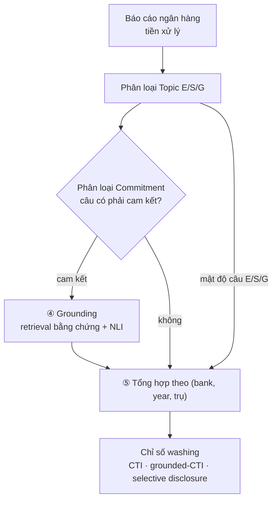

# Đề cương nghiên cứu — Đo lường ESG-washing trong báo cáo của ngân hàng thương mại Việt Nam

> Xây dựng một hệ thống NLP đo *khoảng cách giữa lời nói và việc làm* (talk vs walk) trong báo cáo bền vững của 10 ngân hàng thương mại Việt Nam

---

## 1. Bài toán

**ESG** là viết tắt của ba trụ cột phát triển bền vững mà doanh nghiệp công bố: Môi trường (Environmental), Xã hội (Social), Quản trị (Governance). Hằng năm các ngân hàng phát hành báo cáo bền vững với rất nhiều cam kết kiểu "chúng tôi hướng tới phát thải ròng bằng 0", "đẩy mạnh tín dụng xanh", "tăng cường bình đẳng giới".

**ESG-washing** (tẩy xanh / đánh bóng ESG) là hiện tượng **nói nhiều hơn làm**: báo cáo dày đặc cam kết nghe hay nhưng **mơ hồ, không số liệu, không bằng chứng** — mang tính hình thức thay vì thực chất. Về mặt lý thuyết , đây là hiện tượng **decoupling** giữa *talk* (điều được nói) và *walk* (điều thực sự làm và chứng minh được).

**Mục tiêu:** từ văn bản báo cáo, **tự động phát hiện và đo mức độ** cam kết suôn.

---

## 2. Vấn đề cần giải quyết

1. Hầu hết nghiên cứu NLP về washing chỉ làm tiếng Anh và chỉ ở trụ Môi trường (green/climate). Chưa có ai làm **full E/S/G cho ngân hàng Việt Nam**.
2. **Không có "walk data" thật cho VN.** Ở nước ngoài có thể đối chiếu cam kết với phát thải/đánh giá ESG bên thứ ba (CDP, MSCI, RepRisk). Việt Nam gần như không có → phải đo "walk" **ngay trong chính văn bản** (mức cụ thể + bằng chứng đi kèm), không dựa vào dữ liệu ngoài.

---

## 3. Dữ liệu


### 3.1 `data/en_gold/translate/` — nguồn nhãn train
| File | Dòng | Nhãn | Vai trò | Nguồn |
|---|---|---|---|---|
| `environmental_2k.csv` | 2000 | E ∈{0,1} | topic | ESGBERT (Mehra 2022) |
| `social_2k.csv` | 2000 | S ∈{0,1} | topic | ESGBERT |
| `governance_2k.csv` | 2000 | G ∈{0,1} | topic | ESGBERT |
| `commitments_actions.{train,test}.parquet` | 1000/320 | commitment/action ∈{0,1} | **mẫu số** đo washing | ClimateBERT |
| `specificity.{train,test}.parquet` | 1000/320 | specific ∈{0,1} | **tử số** đo washing | Bingler 2022 |
| `netzero_reduction.csv` | 3441 | {none, reduction, net-zero} | tín hiệu phụ (chỉ E) | Schimanski 2023 |
| `env_claims.{train,val,test}.parquet` | 2117/265/265 | claim ∈{0,1} | tín hiệu phụ (chỉ E) | Stammbach 2022 |
| `action_500.csv` | 500 | action ∈{0,1} | dự phòng augment cho S/G | ESGBERT |

---

## 4. Phương pháp

### 4.1 Sơ đồ pipeline tổng quát



### 4.2 Các thành phần & mô hình

| # | Thành phần | Mô hình | Reference |
|---|---|---|---|
| ① | **Topic E/S/G** — multi-label phẳng, 3 đầu sigmoid | `vinai/phobert-base` fine-tune | ESGBERT (Mehra 2022); PhoBERT (Nguyen & Nguyen 2020) |
| ② | **Commitment / Action** — nhị phân | PhoBERT fine-tune | ClimateBERT |
| ③ | **Specificity** — nhị phân | PhoBERT fine-tune | Bingler 2022 |
| ④ | **Grounding — retrieval** | `bkai-foundation-models/vietnamese-bi-encoder` | — |
| ④ | **Grounding — NLI** claim–evidence {entail, neutral, contradict} | `MoritzLaurer/mDeBERTa-v3-base-mnli-xnli` | FEVER (Thorne 2018), CLIMATE-FEVER (Diggelmann 2020) |
| ⑤ | **Chỉ số washing** | Cheap Talk Index / grounded-CTI | Bingler 2022 (chi tiết §6) |

---

## 5. Chỉ số kết quả cuối cùng — đo mức độ giữa *talk* và *walk*

**Đề xuất dùng `Cheap Talk Index` (CTI), mở rộng bằng lớp grounding (grounded-CTI), để đo khoảng cách giữa *talk* và *walk*.** (Bingler, Kraus, Leippold, Webersinke 2022 — *Cheap Talk and Cherry-Picking*, Finance Research Letters.) Chỉ số chỉ là **tỉ lệ giữa output của các classifier đã công bố** — không thang/trọng số tự đặt.

### 5.1 "Talk" và "walk" được vận hành như thế nào
- **Talk** = những gì ngân hàng *nói ra*: các câu **cam kết** (Commitment/Action classifier — ②).
- **Walk** (proxy nội văn bản) = cam kết đó có *thực chất* không, đo bằng 2 lớp:
  1. **Cụ thể (Specificity — ③):** bản thân câu có số liệu/mốc/đối tượng rõ ràng không.
  2. **Có bằng chứng đỡ (Grounding — ④):** trong cùng báo cáo có span bằng chứng *entail* được cam kết không.

### 5.2 Công thức CTI
Cho mỗi (ngân hàng `b`, năm `y`, trụ `p`):

```
CTI(b,y,p) = #{câu commitment mà specificity = 0}  /  #{câu commitment}
```

- CTI ∈ [0,1]; **càng cao = càng nhiều cam kết suông = washing càng nặng.**
- Báo cáo kèm **bootstrap confidence interval**, xếp hạng theo trụ và theo ngân hàng/năm.

### 5.3 Mở rộng faithfulness — grounded-CTI
Một câu "specific" chưa chắc *có thực chứng*. Lớp Grounding (§4 ④) bổ sung:

```
grounded-CTI(b,y,p) = #{commitment: non-specific  HOẶC  specific-nhưng-không-grounded}  /  #{commitment}
```

→ lộ ra "cheap talk ẩn" mà CTI thuần specificity bỏ sót. **Báo cáo CTI và grounded-CTI tách bạch**

### 5.4 Chỉ số phụ trợ — selective disclosure (cherry-picking)
Phân bố tần suất câu theo trụ E/S/G; lệch mạnh = né chủ đề khó (Bingler 2021; Rouen 2023). **Báo cáo phân bố

---

## 6. Kế hoạch công việc

Thứ tự phụ thuộc: **T0 → (T1, T2 song song) → T3 → T4 → T5 → T6 → T7 → T8 → T9 → T10 → T11**. T12 (dọn code) làm sớm khi tiện.

| # | Việc | Deliverable | Done when |
|---|---|---|---|
| **T0** | Môi trường: cài deps; accept license + login HF; smoke-test dịch; tải NLI + bi-encoder | `requirements.txt`, model ids ghi vào Notes | dịch thử ra tiếng Việt hợp lý, không lỗi auth/OOM |
| **T1** | Làm sạch corpus VN (NFC, sửa OCR, lọc câu rác, khử trùng lặp, tách từ) | `data/corpus/sentences_clean.parquet` + thống kê | spot-check 30 câu sạch, phân bố bank/year hợp lý |
| **T2** | Dịch gold EN→VN bằng TranslateGemma (giữ nhãn), tách từ | `data/vi_gold/<task>/<split>.parquet` | đủ dòng khớp gold, giữ nghĩa & số, nhãn không xê dịch |
| **T3** | Chuẩn hoá nhãn — KHÔNG dựng thang (topic 3 cột nhị phân; commitment/specificity giữ nhãn gốc) | các parquet train/val/test theo task | phân bố nhãn hợp lý, không leak giữa split |
| **T4** | Train **Topic** (PhoBERT, 3 sigmoid, BCE); eval gold EN (upper-bound) | `outputs/models/topic/`, `metrics/topic.json` | Macro-F1 > baseline, tái lập được |
| **T5** | Train **Commitment** (mẫu số) + **Specificity** (tử số) | `outputs/models/{commitment,specificity}/`, `metrics/claim_attrs.json` | mỗi classifier > baseline; ghi rõ trần specificity (α=0.17) |
| **T6** | Lọc nhiễu (QE + Confident Learning) + đánh giá transfer (zero-shot XLM-R vs translate-train; có/không CL) | `metrics/exp3.json`, `exp5.json` | bảng so sánh đủ; kết luận kể cả null |
| **T7** | **Grounding**: retrieval span bằng chứng + claim–evidence NLI (giữ phân phối); đo grounded share | `outputs/grounding/*`, `metrics/exp4.json` | span hợp lệ; NLI không nhị phân hoá; có số grounded share |
| **T8** | **Cheap Talk Index**: chạy commitment+specificity trên corpus; CTI per (bank,year,trụ) + bootstrap CI; selective disclosure; grounded-CTI | `outputs/index/cti.parquet` + ranking | CTI có CI; chỉ là tỉ lệ 2 classifier; tái lập được |
| **T9** | Validation chỉ số: tạo `bank_signals.csv`; known-group; synthetic manipulation; sensitivity | `metrics/exp6/7/8.json` | có kết luận known-group; CTI phản ứng đúng synthetic; ranking ổn định |
| **T10** | Baselines + upper-bound EN; case study (trích cam kết cheap-talk theo bank); đóng gói dataset translate-train công khai | `metrics/exp1/2.json`; báo cáo case study; dataset + README | đủ bảng cho paper; dataset có nguồn gốc rõ |
| **T11** | Viết bài: ghép kết quả + hình; Limitations (specificity α=0.17, no ground-truth washing, commitment/specificity train trên dữ liệu climate áp cho S/G, no walk thật, dịch máy) | bản thảo | — |
| **T12** | Dọn code cũ: xoá `ewri.py`, `ewri_grid_search.py`, `neuro_symbolic.py`; gỡ `es_combined` nhị phân & nhãn `topic_llm_labeler`; cập nhật `config/pipeline.yml`/`run.py` | — | repo hết tham chiếu module bỏ; pipeline mới chạy 1 bank thử |
