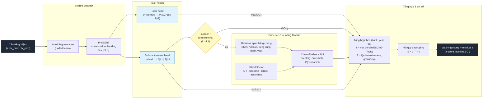

# Kiến trúc hệ thống (inference forward path) — Phương án B

Figure kiểu paper: luồng tính toán **lúc chạy trực tiếp** trên một câu báo cáo tiếng Việt → đến điểm số washing ở mức (bank, year, trụ). Không bao gồm train/validation (xem `research-plan-B.md`).

## Diễn giải khối (theo thứ tự forward)
| Khối | Vào → Ra | Ghi chú |
|---|---|---|
| **Shared Encoder** | câu VN → vector `h` | PhoBERT, dùng chung cho cả 2 head; bắt buộc tách từ trước. |
| **Topic head** | `h` → P(E), P(S), P(G) | 3 sigmoid độc lập (multi-label, phẳng); cấp tín hiệu **Talk T**. |
| **Substantiveness head** | `h` → L0–L3 | đầu ordinal (CORN/CORAL); cấp mức thực chất câu. |
| **Claim gate** | L → {có/không} | chỉ câu claim/commitment mới đi tiếp sang grounding (tiết kiệm + đúng ngữ nghĩa). |
| **Evidence Grounding** | claim → P(entail/neutral/contradict) + slot | retrieval bằng chứng trong cùng báo cáo → NLI **giữ nguyên phân phối**, không nhị phân hoá. |
| **Tổng hợp & chỉ số** | (T, S) theo (bank, year, trụ) → washing score | **washing = phần dư hồi quy S~T** (decoupling-as-residual). |

> Đây là kiến trúc **runtime** đơn-câu rồi gộp lên mức tổ chức. Encoder PhoBERT là backbone dùng chung; 2 head + module grounding nhánh ra; chỉ số washing là residual ở cuối.
