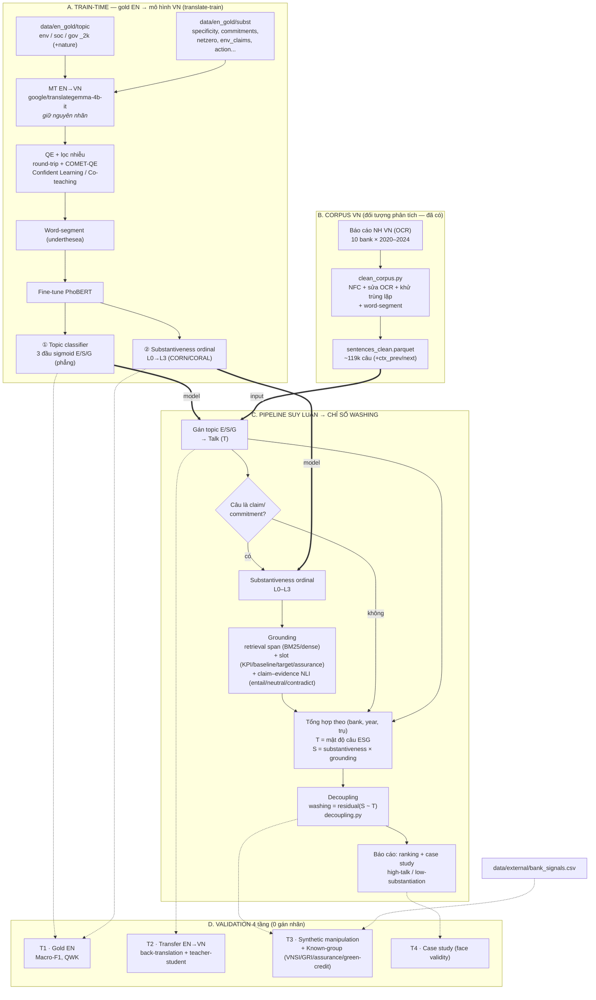

# Kiến trúc pipeline — Phương án B (ESG-washing NH VN, cross-lingual)

Sơ đồ tổng thể: 4 khối — **(A)** train mô hình từ gold EN qua translate-train, **(B)** chuẩn bị corpus VN, **(C)** pipeline suy luận → chỉ số washing, **(D)** validation 4 tầng. (Đồng bộ với `research-plan-B.md`; đã bỏ neuro-symbolic.)

## Đọc nhanh theo dòng dữ liệu
1. **Gold EN** → dịch sang VN bằng `translategemma-4b-it` (giữ nhãn) → lọc nhiễu (QE + Confident Learning) → fine-tune **PhoBERT** ra 2 mô hình: **Topic E/S/G** và **Substantiveness L0–L3**. Train **chỉ** trên gold chuyên gia đã dịch — không có nhãn LLM.
2. **Corpus VN** (OCR 10 bank × 5 năm) → làm sạch → ~119k câu sạch + tách từ; **chỉ dùng để inference**, không làm nhãn train.
3. **Suy luận:** mỗi câu → topic (đo **Talk T**); câu nào là claim → substantiveness + **grounding** (retrieval + slot + NLI giữ phân phối) → đo **Substantiation S**.
4. Tổng hợp theo (bank, year, trụ) → **washing = phần dư hồi quy S ~ T** → báo cáo & case study.
5. **Validation** bám 4 điểm: gold EN, consistency transfer, synthetic + known-group, case study.

> Ghi chú: nét `==>` = nạp mô hình đã train vào suy luận; nét `-.->` = luồng kiểm chứng/phụ trợ; nét liền = luồng dữ liệu chính.
